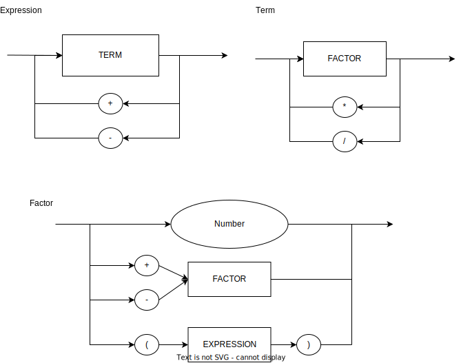

# LogComp2022

## EBNF:

DIGIT = 0|1|2|3|4|5|6|7|8|9;
NUMBER = DIGIT, {DIGIT};
EXPRESSION = TERM, { ("+" | "-"), TERM } ;
TERM = FACTOR, { ("*" | "/"), FACTOR } ;
FACTOR = ("+" | "-") FACTOR | "(" EXPRESSION ")" | NUMBER ;

